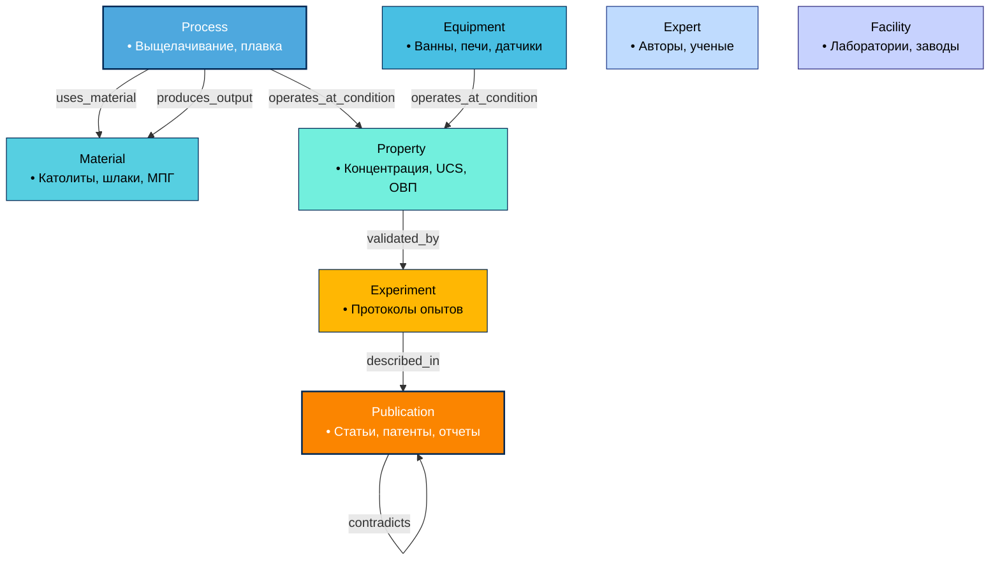

# nornickel-scientific-knot

## Схема

```mermaid
graph TD
    %% Определение ВСЕХ 8 классов онтологии по ТЗ
    Process[Process <br>• Выщелачивание, плавка]
    Material[Material <br>• Католиты, шлаки, МПГ]
    Property[Property <br>• Концентрация, UCS, ОВП]
    Equipment[Equipment <br>• Ванны, печи, датчики]
    Experiment[Experiment <br>• Протоколы опытов]
    Publication[Publication <br>• Статьи, патенты, отчеты]
    Expert[Expert <br>• Авторы, ученые]
    Facility[Facility <br>• Лаборатории, заводы]

    %% Настройка связей (Разрешенные 6 типов отношений)
    Process -->|uses_material| Material
    Process -->|operates_at_condition| Property
    Process -->|produces_output| Material
    Equipment -->|operates_at_condition| Property
    Property -->|validated_by| Experiment
    Experiment -->|described_in| Publication
    Publication -->|contradicts| Publication

    %% Стилизация всех 8 классов для красивого отображения в интерфейсе GitHub
    style Process fill:#4EA8DE,stroke:#002855,stroke-width:2px,color:#fff
    style Material fill:#56CFE1,stroke:#002855,stroke-width:1px,color:#000
    style Property fill:#72EFDD,stroke:#002855,stroke-width:1px,color:#000
    style Equipment fill:#48BFE3,stroke:#002855,stroke-width:1px,color:#000
    style Experiment fill:#FFB703,stroke:#002855,stroke-width:1px,color:#000
    style Publication fill:#FB8500,stroke:#002855,stroke-width:2px,color:#fff
    style Expert fill:#bfdbfe,stroke:#1e3a8a,stroke-width:1px,color:#000
    style Facility fill:#c7d2fe,stroke:#312e81,stroke-width:1px,color:#000
```
