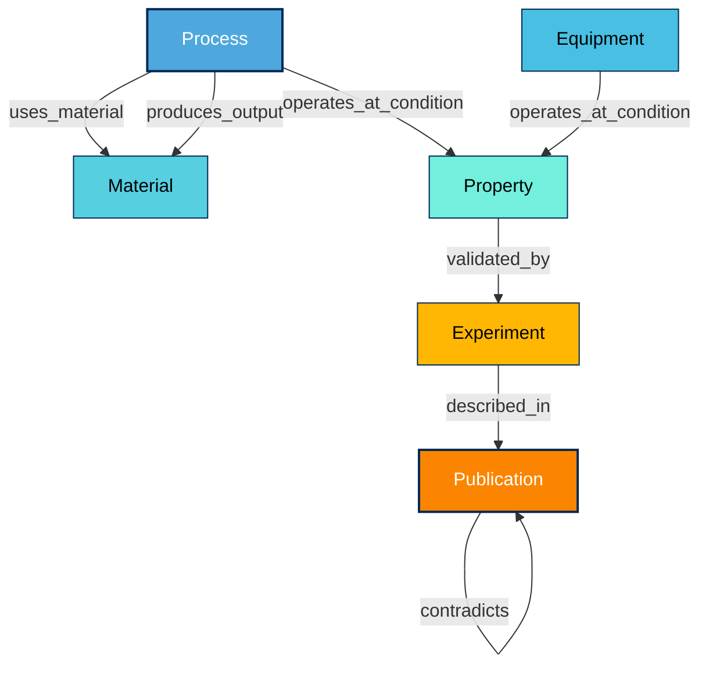

# nornickel-scientific-knot

## Схема

```mermaid
graph TD
    %% Определение классов онтологии
    Process[Process]
    Material[Material]
    Property[Property]
    Equipment[Equipment]
    Experiment[Experiment]
    Publication[Publication]

    %% Настройка связей по ТЗ
    Process -->|uses_material| Material
    Process -->|operates_at_condition| Property
    Process -->|produces_output| Material
    Property -->|validated_by| Experiment
    Experiment -->|described_in| Publication
    Publication -->|contradicts| Publication
    Equipment -->|operates_at_condition| Property

    %% Стилизация для красивого отображения в GitHub
    style Process fill:#4EA8DE,stroke:#002855,stroke-width:2px,color:#fff
    style Material fill:#56CFE1,stroke:#002855,stroke-width:1px,color:#000
    style Property fill:#72EFDD,stroke:#002855,stroke-width:1px,color:#000
    style Equipment fill:#48BFE3,stroke:#002855,stroke-width:1px,color:#000
    style Experiment fill:#FFB703,stroke:#002855,stroke-width:1px,color:#000
    style Publication fill:#FB8500,stroke:#002855,stroke-width:2px,color:#fff
```