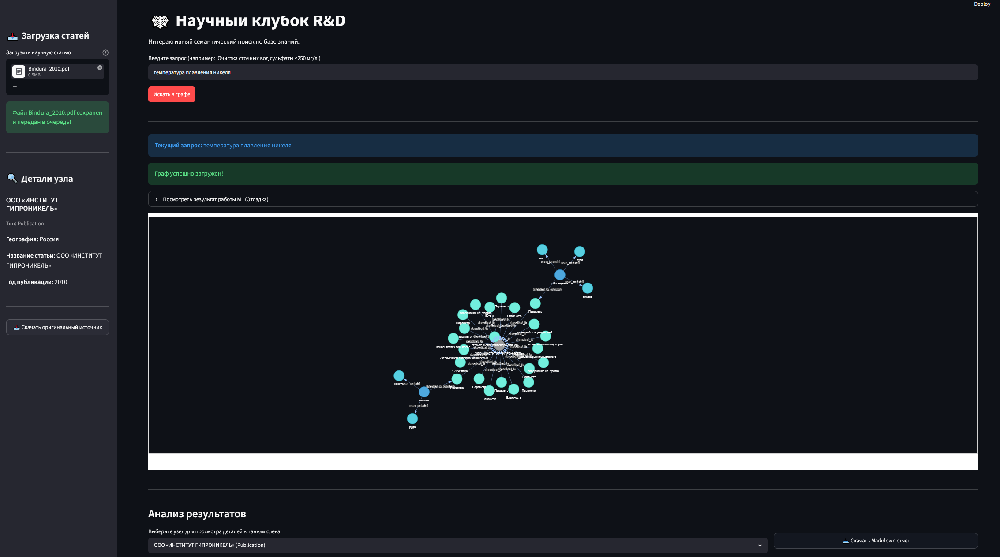
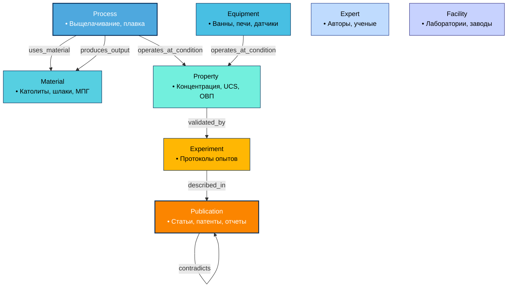

# 🕸️ Научный клубок R&D (Nornickel Scientific Knot)

Интерактивная графовая поисковая система по базе знаний научно-исследовательских статей (PDF, DOCX). Проект использует методы Machine Learning (NLP, SpaCy) для извлечения физико-химических утверждений из текста и формирования интеллектуального графа знаний (Neo4j) с возможностью семантического поиска.



## 🏗️ Архитектура онтологии


## 🚀 Руководство по развертыванию

Проект состоит из трех основных компонентов: графовой базы данных (Neo4j), высоконагруженного API (Go) и ML/UI-составляющей (Python). Для работы системы они должны быть запущены одновременно.

### Требования
* **Docker** и **Docker Compose**
* **Go** (версия 1.20+)
* **Python** (версия 3.10+)

### Шаг 1. Поднятие базы данных (Neo4j)
Для хранения графов используется Neo4j 5.x.
```bash
# В корне проекта создайте .env файл на основе примера
cp .env.example .env

# Запустите базу данных через Docker Compose
docker-compose up -d neo4j
```
*Интерфейс базы данных будет доступен по адресу http://localhost:7474*

### Шаг 2. Запуск Go-бэкенда
Go-бэкенд отвечает за векторный поиск и графовый обход подграфов с помощью Cypher.
```bash
cd backend-go

# Загрузка переменных окружения и запуск
# Для Linux/Mac:
export $(cat ../.env | xargs) && go run ./cmd/main.go

# Для Windows (PowerShell):
$env:LOGGER_FOLDER="./out/logs"; Get-Content ..\.env | ForEach-Object { if ($_ -match '^\s*([^#=]+)\s*=\s*(.*)\s*$') { Set-Item -Path "env:\$($matches[1])" -Value $matches[2] } }; go run ./cmd/main.go
```
*API будет доступно по адресу http://localhost:5050*

### Шаг 3. Запуск Python (ML и Streamlit)
Python отвечает за пайплайн извлечения (NLP) и пользовательский интерфейс.
```bash
cd backend-python

# Создание и активация виртуального окружения
python -m venv venv
# Linux: source venv/bin/activate
# Windows: .\venv\Scripts\activate

# Установка зависимостей
pip install -r requirements.txt

# Скачивание моделей SpaCy
python -m spacy download ru_core_news_md
python -m spacy download en_core_web_md
```

Для работы полного цикла необходимо запустить **оба** процесса в разных терминалах:

**1. Фоновый обработчик (ETL Pipeline)**
Следит за папкой `inbound/`, парсит новые документы и извлекает знания:
```bash
python pipeline.py
```

**2. Веб-интерфейс (Streamlit)**
Визуализация графа и интерактивный поиск:
```bash
streamlit run app.py
```
*Приложение откроется в браузере по адресу http://localhost:8501*

---
## 📦 Структура проекта
* `backend-go/` — микросервис для быстрого поиска и обхода графов (Clean Architecture).
* `backend-python/ml/` — NLP пайплайн извлечения сущностей и отношений.
* `backend-python/parser/` — набор парсеров для разбора файлов (`.pdf`, `.docx`, `.txt`, архивов).
* `backend-python/app.py` — Streamlit интерфейс с отрисовкой через Pyvis.

---

## 🏗️ Краткая архитектура (подробности в [ARCHITECTURE.md](ARCHITECTURE.md))

Проект состоит из трех ключевых слоев, обеспечивающих полный цикл обработки документов и поиска:
1. **Машинное обучение (Python + SpaCy):** Автоматически "читает" загруженные PDF/DOCX документы, извлекает процессы, материалы, параметры и строит связи между ними.
2. **База данных и Бэкенд (Neo4j + Go):** Хранит огромный граф знаний. Высокопроизводительный Go-микросервис обрабатывает поисковые запросы: ищет нужные узлы через **векторный поиск**, а затем обходит граф с помощью Cypher, возвращая только релевантную паутину знаний.
3. **Фронтенд (Streamlit + Pyvis):** Превращает сложные данные в интерактивный граф в браузере, генерирует текстовые сводные Markdown-отчеты и позволяет скачивать статьи.
